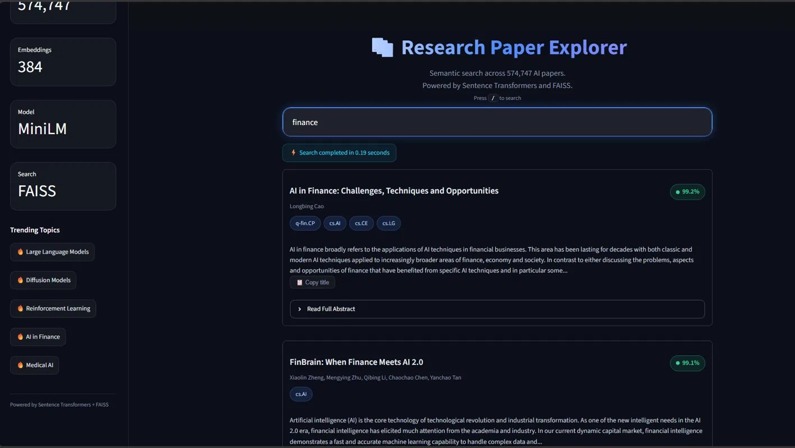
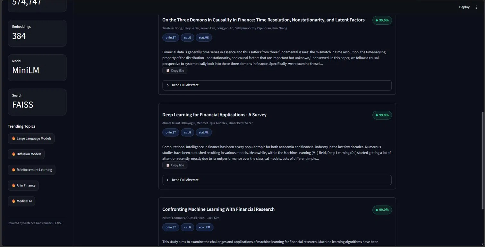

# 🔎 PaperLens - Research Paper Explorer

A semantic search engine over **574,747 AI research papers** from arXiv. Built with Sentence Transformers, FAISS, and Streamlit. Returns the most semantically relevant papers for any natural language query in under 0.5 seconds.

---

## Demo


 


Search example: *"large language models in finance"* → returns relevant papers ranked by cosine similarity in ~0.19s.

---

## Architecture

```
User Query (natural language)
        │
        ▼
┌───────────────────┐
│  Sentence         │  all-MiniLM-L6-v2
│  Transformer      │  Query → 384-dim vector
│  (Encode + Norm)  │  + L2 normalization
└────────┬──────────┘
         │  384-dim float32 vector
         ▼
┌───────────────────┐
│   FAISS           │  IndexFlatIP
│   Vector Search   │  Cosine similarity search
│                   │  over 574,747 vectors
└────────┬──────────┘
         │  Top-K indices + similarity scores
         ▼
┌───────────────────┐
│   Paper Lookup    │  pandas DataFrame
│   (pkl)           │  title, authors, abstract,
│                   │  categories
└────────┬──────────┘
         │
         ▼
┌───────────────────┐
│   Streamlit UI    │  Ranked result cards
│                   │  with similarity badges
└───────────────────┘
```

### Data Pipeline

```
arXiv JSON snapshot (3M+ papers)
        │
        ▼  filter_papers.py
AI-category papers only
(cs.AI, cs.LG, cs.CL, cs.CV, stat.ML)
        │
        ▼  574,747 papers → ai_papers.csv + papers.pkl
        │
        ▼  create_embeddings.py
Encode title + abstract with all-MiniLM-L6-v2
Apply L2 normalization → paper_embeddings.npy
        │
        ▼  build_index.py
Build FAISS IndexFlatIP → paper_index.faiss
```

---

## Stack

| Component | Technology | Why |
|---|---|---|
| Embedding model | `all-MiniLM-L6-v2` | 384-dim, fast, strong semantic understanding |
| Vector index | FAISS `IndexFlatIP` | Exact cosine similarity, sub-second at 574k scale |
| Similarity metric | Cosine similarity | Normalized inner product, bounded [0, 1] |
| Data store | pandas + pickle | In-memory after first load, ~500ms cold start |
| Frontend | Streamlit | Python-native, rapid iteration |

---

## Evaluation

Measured with **Precision@5** — for each query, what fraction of the top 5 results belong to the expected category. Evaluated on 50 hand-labeled queries across 8 topic areas.

| Category | Queries | Precision@5 |
|---|---|---|
| Natural Language Processing | 10 | 98.0% |
| Computer Vision | 10 | 100% |
| Machine Learning | 10 | 96.0% |
| Reinforcement Learning | 5 | 100% |
| Diffusion / Generative Models | 5 | 100% |
| AI Applications | 5 | 96.0% |
| Ethics & Robustness | 5 | 100% |
| **Overall** | **50** | **98.0% (46/50 perfect)** |

Run the evaluation yourself:

```bash
python src/eval.py
```

### Where it falls short (the honest 4)

| Query | Precision@5 | Reason |
|---|---|---|
| `transformer attention mechanism` | 80% | "Transformer" matches non-NLP papers (power transformers, circuit transformers) without stronger context |
| `knowledge distillation model compression` | 60% | Distillation papers often appear under `cs.CV` or `cs.NE` rather than `cs.LG` — results are topically correct but categorically unexpected |
| `protein structure prediction AlphaFold` | 80% | Biology-adjacent papers straddle `q-bio` and `cs.LG`; 1 result lands in `q-bio.BM` which was outside the expected set |
| `anomaly detection fraud detection` | 80% | Fraud detection papers frequently appear under `q-fin` rather than `cs.LG`/`stat.ML` |

**Key insight:** all 4 failures are category labeling edge cases, not semantic retrieval failures. The returned papers are topically relevant — arXiv authors self-assign categories inconsistently across domains, so true retrieval quality is higher than the 98.0% metric captures.

---

## Design Decisions

**Why cosine similarity instead of L2 distance?**

L2 distance on raw embeddings is affected by vector magnitude, not just direction. Two papers with identical semantic meaning but different embedding magnitudes would appear dissimilar under L2. Cosine similarity on L2-normalized vectors measures only the angle between vectors — purely semantic content — and is bounded in [0, 1], making the similarity percentage displayed in the UI meaningful.

**Why `IndexFlatIP` instead of approximate indexes (IVF, HNSW)?**

At 574k vectors × 384 dimensions, `IndexFlatIP` fits comfortably in memory (~835MB) and returns exact nearest neighbors with no recall penalty. Approximate indexes trade accuracy for speed and memory, which only becomes necessary at 10M+ vectors. For this dataset, exact search is both feasible and correct.

**Why MiniLM over larger models (MPNet, BGE-large)?**

`all-MiniLM-L6-v2` encodes a query in ~20ms on CPU, making real-time search practical without a GPU. Larger models like `bge-large-en` produce higher quality embeddings but take 300-500ms per query on CPU — too slow for interactive use. MiniLM hits the right point on the speed/quality curve for this use case.

**Why title + abstract for embedding, not title alone?**

Title alone loses methodological detail — two papers titled similarly ("Attention is All You Need" vs "Attention Mechanisms in NLP") may be very different. Abstract adds enough semantic signal to distinguish papers by method, dataset, and contribution, without the noise of full-text.

---

## Setup

```bash
# 1. Clone and install
git clone https://github.com/Noel-Ann-Roy/PaperLens.git
cd PaperLens
pip install -r requirements.txt

# 2. Download arXiv dataset
# https://www.kaggle.com/datasets/Cornell-University/arxiv
# Place at data/raw/arxiv-metadata-oai-snapshot.json

# 3. Build the pipeline
python src/filter_papers.py      # Filter to AI papers
python src/convert_pickle.py     # Save as pickle for fast loading
python src/create_embeddings.py  # Generate + normalize embeddings
python src/build_index.py        # Build FAISS index

# 4. Run
streamlit run app/app.py
```

**Requirements:**
- Python 3.10+
- ~4GB RAM
- ~6GB disk (embeddings + index + dataset)

---

## Project Structure

```
PaperLens/
├── assets/
│   ├── img1.jpg              
│   └── img2.jpg
├── app/
│   ├── app.py              # Streamlit UI
│   └── styles.css          # Dark theme styles
├── src/
│   ├── filter_papers.py    # arXiv → AI papers CSV
│   ├── convert_pickle.py   # CSV → pickle for fast loading
│   ├── create_embeddings.py # Encode + normalize embeddings
│   ├── build_index.py      # Build FAISS IndexFlatIP
│   ├── recommender.py      # Search function
│   ├── search.py           # Lightweight CLI search tool
│   └── eval.py             # Precision@5 evaluation
├── data/
│   ├── raw/                # arXiv JSON snapshot
│   └── processed/          # ai_papers.csv, papers.pkl
└── models/
    ├── paper_embeddings.npy
    └── paper_index.faiss
```

---

## Dataset

- **Source:** [arXiv Dataset](https://www.kaggle.com/datasets/Cornell-University/arxiv) (Kaggle / Cornell University)
- **Filtered categories:** `cs.AI`, `cs.LG`, `cs.CL`, `cs.CV`, `stat.ML`
- **Papers indexed:** 574,747
- **Embedding dimensions:** 384
